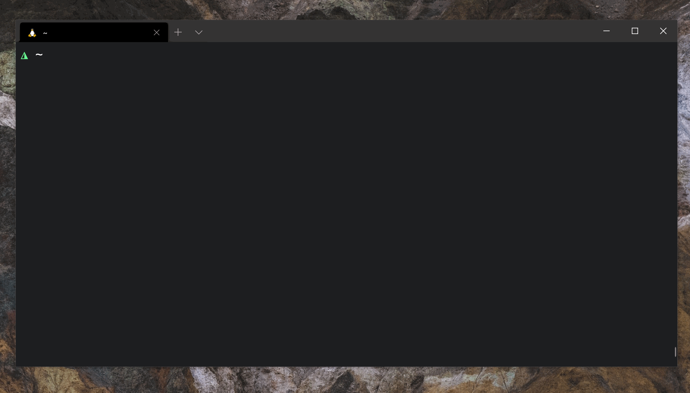

<h3 align="center">
    DOTFILES
</h3>
<h6 align="center" style="color: #6c757d!important;">
  Simple installer backup dotfiles
</h6>

<p align="center">

</p>



## Installation and usage
```bash
bash <(curl -s https://github.com/avflo/dotfiles)
cd dotfiles && ./install
```

## ⚖️ License
The MIT License (MIT). Please see [License](LICENSE) for more information.